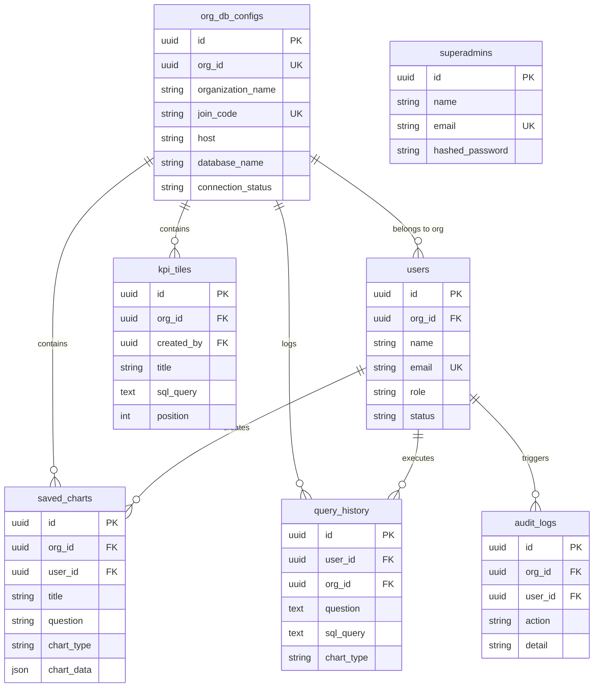
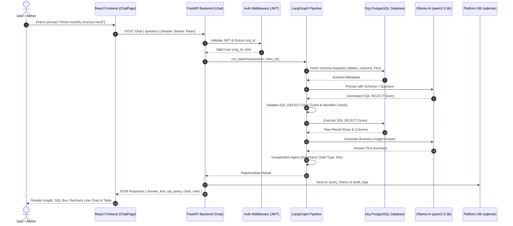
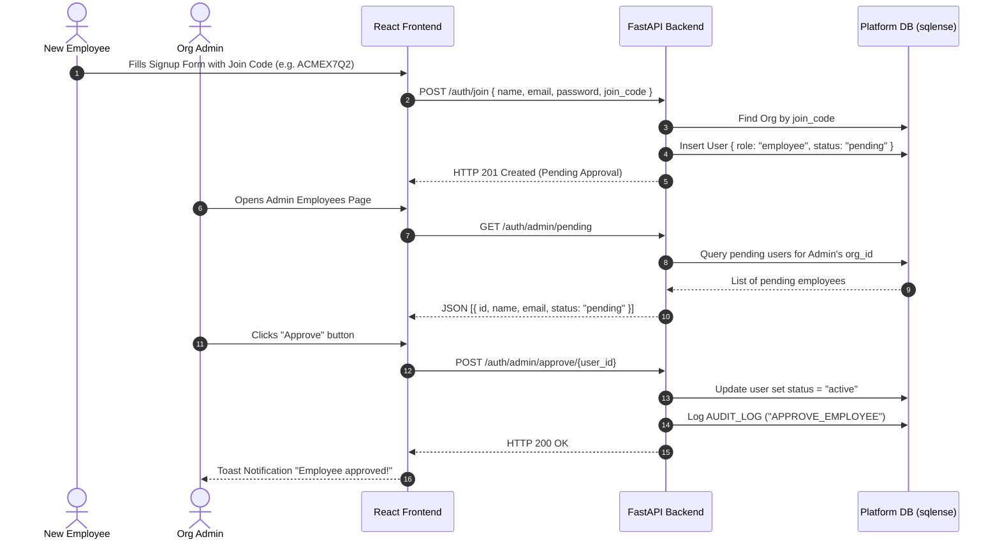
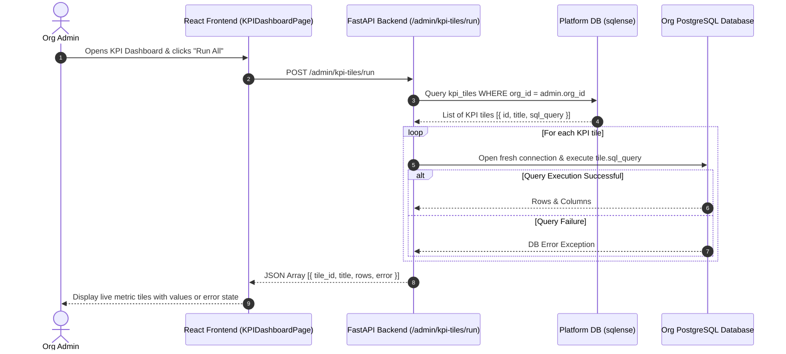
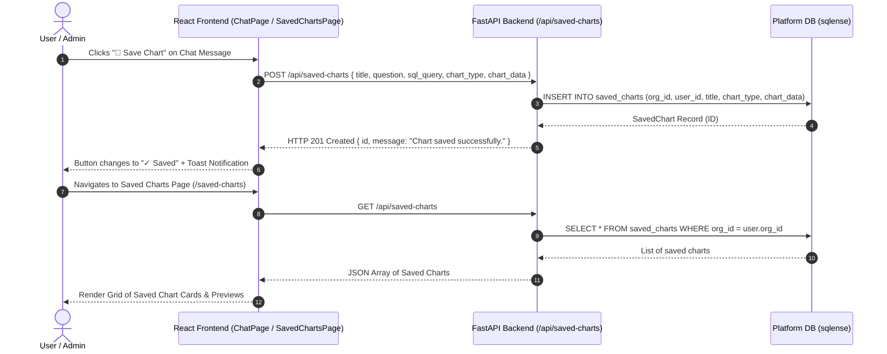
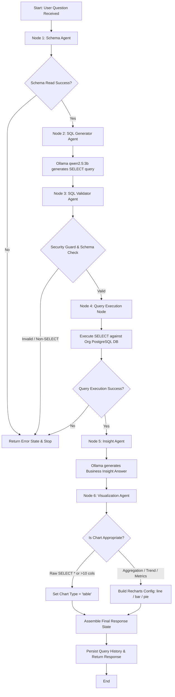
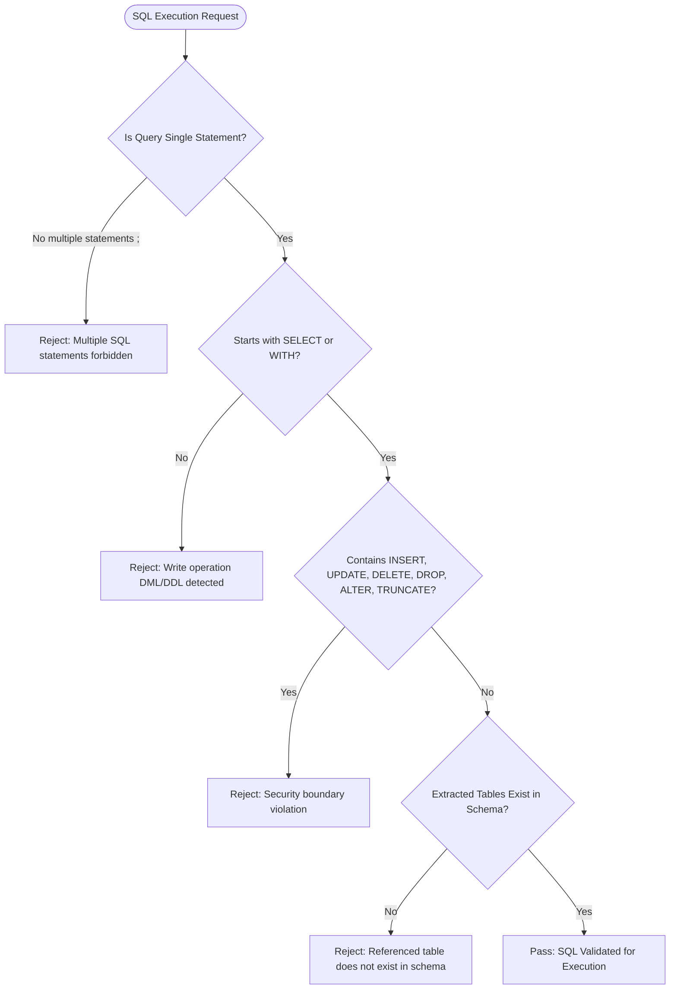
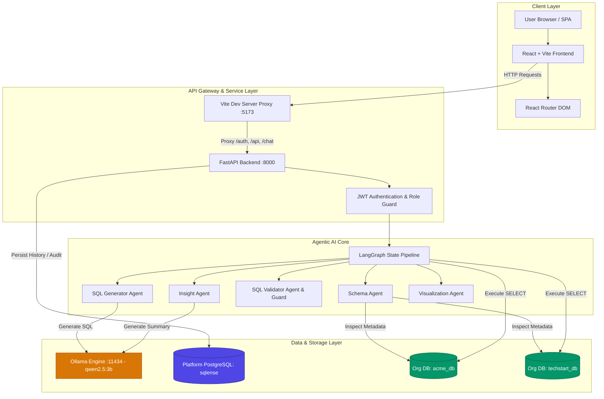

# SQLense — System Architecture, Schema & Diagram Blueprint

**Version:** 2.0.0 | **Author:** SQLense Engineering Team | **Last Updated:** August 2026

> This document serves as the comprehensive technical specification and blueprint for developers to understand the platform, design UML diagrams (Sequence, Activity, Use Case), ER diagrams, and system flowcharts.

---

## Table of Contents

1. [Official SQLense Platform Database Specification](#1-official-sqlense-platform-database-specification)
   - [Database Overview](#database-overview)
   - [Table 1: users](#table-1-users)
   - [Table 2: org_db_configs](#table-2-org_db_configs)
   - [Table 3: kpi_tiles](#table-3-kpi_tiles)
   - [Table 4: saved_charts](#table-4-saved_charts)
   - [Table 5: query_history](#table-5-query_history)
   - [Table 6: audit_logs](#table-6-audit_logs)
   - [Table 7: superadmins](#table-7-superadmins)
   - [Entity-Relationship (ER) Diagram](#entity-relationship-er-diagram)
2. [UML Use Case Diagrams](#2-uml-use-case-diagrams)
3. [UML Sequence Diagrams](#3-uml-sequence-diagrams)
   - [Sequence 1: AI Chat Query Execution](#sequence-1-ai-chat-query-execution)
   - [Sequence 2: Employee Join & Admin Approval](#sequence-2-employee-join--admin-approval)
   - [Sequence 3: KPI Dashboard Live Execution](#sequence-3-kpi-dashboard-live-execution)
   - [Sequence 4: Saved Chart Creation & Persistence](#sequence-4-saved-chart-creation--persistence)
4. [UML Activity Diagrams](#4-uml-activity-diagrams)
   - [Activity 1: LangGraph AI Pipeline Processing](#activity-1-langgraph-ai-pipeline-processing)
   - [Activity 2: SQL Guard & Validation Security Gatekeeper](#activity-2-sql-guard--validation-security-gatekeeper)
5. [System Architecture Flowchart](#5-system-architecture-flowchart)

---

## 1. Official SQLense Platform Database Specification

### Database Overview
The **SQLense Platform Database** (named `sqlense`) is a PostgreSQL relational database that manages platform authentication, organisation configurations, access permissions, query histories, KPI metric tiles, saved visualizations, and security audit trails.

> ℹ️ **Note:** The `sqlense` database stores platform metadata only. End-user organisation databases (e.g. `acme_db`, `techstart_db`) are completely separate and isolated.

---

### Table 1: `users`
Stores all registered administrators and employees.

| Column | Type | Constraints | Description |
|---|---|---|---|
| `id` | `UUID` | Primary Key, Default: `gen_random_uuid()` | Unique user identifier |
| `org_id` | `UUID` | Indexed, Not Null | Organisation UUID (matches `org_db_configs.org_id`) |
| `name` | `VARCHAR(100)` | Not Null | Full display name |
| `email` | `VARCHAR(150)` | Unique, Not Null, Indexed | Login email address |
| `hashed_password` | `VARCHAR(255)` | Not Null | Bcrypt hashed password |
| `role` | `VARCHAR(20)` | Not Null, Default: `'employee'` | User role (`'admin'`, `'employee'`) |
| `status` | `VARCHAR(20)` | Not Null, Default: `'pending'` | Approval status (`'active'`, `'pending'`, `'rejected'`) |
| `created_at` | `TIMESTAMPTZ` | Not Null, Default: `NOW()` | Registration timestamp |

---

### Table 2: `org_db_configs`
Stores encryption keys, connection parameters, and join codes for each organisation.

| Column | Type | Constraints | Description |
|---|---|---|---|
| `id` | `UUID` | Primary Key, Default: `gen_random_uuid()` | Unique configuration ID |
| `org_id` | `UUID` | Unique, Not Null, Indexed | Organisation UUID linking admins and employees |
| `organization_name`| `VARCHAR(255)`| Nullable | Display name of the organisation (e.g. "Acme Corp") |
| `join_code` | `VARCHAR(20)` | Unique, Nullable, Indexed | 8-character code for employee self-registration |
| `db_type` | `VARCHAR(50)` | Not Null, Default: `'postgresql'`| Engine type (`postgresql`, `mysql`, `sqlite`) |
| `host` | `VARCHAR(255)`| Nullable | Hostname or IP of the org's database |
| `port` | `INTEGER` | Nullable, Default: `5432` | Port number |
| `database_name` | `VARCHAR(255)`| Nullable | Target database name |
| `username` | `VARCHAR(255)`| Nullable | Database connection username |
| `encrypted_password`| `VARCHAR(512)`| Nullable | Fernet symmetric encrypted password |
| `ssl_mode` | `VARCHAR(50)` | Nullable | SSL mode (e.g. `require`, `disable`) |
| `connection_status` | `VARCHAR(20)`| Not Null, Default: `'disconnected'`| Status (`'connected'`, `'disconnected'`) |
| `last_connected_at` | `TIMESTAMPTZ`| Nullable | Timestamp of last successful connection check |
| `created_at` | `TIMESTAMPTZ` | Not Null, Default: `NOW()` | Configuration creation timestamp |
| `updated_at` | `TIMESTAMPTZ` | Not Null, Default: `NOW()` | Last configuration update timestamp |

---

### Table 3: `kpi_tiles`
Stores administrator-configured SQL metrics displayed on the Admin KPI Dashboard.

| Column | Type | Constraints | Description |
|---|---|---|---|
| `id` | `UUID` | Primary Key, Default: `gen_random_uuid()` | Unique tile identifier |
| `org_id` | `UUID` | Not Null, Indexed | Organisation UUID |
| `created_by` | `UUID` | Not Null | Admin user ID who created the tile |
| `title` | `VARCHAR(120)` | Not Null | Metric card title (e.g. "Total Revenue") |
| `description` | `VARCHAR(255)` | Nullable | Subtitle/description |
| `sql_query` | `TEXT` | Not Null | Executable SQL SELECT query |
| `position` | `INTEGER` | Not Null, Default: `0` | Order position on grid |
| `created_at` | `TIMESTAMPTZ` | Not Null, Default: `NOW()` | Tile creation timestamp |
| `updated_at` | `TIMESTAMPTZ` | Not Null, Default: `NOW()` | Last modification timestamp |

---

### Table 4: `saved_charts`
Persists user-saved AI chart visualizations and queries.

| Column | Type | Constraints | Description |
|---|---|---|---|
| `id` | `UUID` | Primary Key, Default: `gen_random_uuid()` | Unique saved chart ID |
| `org_id` | `UUID` | Not Null, Indexed | Organisation UUID |
| `user_id` | `UUID` | Not Null, Indexed | User ID who saved the chart |
| `title` | `VARCHAR(200)` | Not Null | Chart title |
| `question` | `VARCHAR(500)` | Not Null | Original natural language user prompt |
| `sql_query` | `VARCHAR(2000)`| Nullable | Generated SQL statement |
| `chart_type` | `VARCHAR(30)` | Nullable | Visualization type (`bar`, `line`, `pie`) |
| `chart_data` | `JSON` | Nullable | JSON array containing Recharts data points |
| `created_at` | `TIMESTAMPTZ` | Default: `NOW()` | Saved timestamp |

---

### Table 5: `query_history`
Maintains an audit trail of all natural language questions and generated SQL queries.

| Column | Type | Constraints | Description |
|---|---|---|---|
| `id` | `UUID` | Primary Key, Default: `gen_random_uuid()` | History record ID |
| `user_id` | `UUID` | Not Null, Indexed | User ID who asked the question |
| `org_id` | `UUID` | Not Null, Indexed | Organisation UUID |
| `question` | `TEXT` | Not Null | Original user prompt |
| `sql_query` | `TEXT` | Not Null | Executed SQL statement |
| `sql_explanation`| `TEXT` | Nullable | Plain English explanation |
| `answer_text` | `TEXT` | Nullable | Business insight response |
| `chart_type` | `VARCHAR(20)` | Default: `'none'` | Resulting chart type |
| `created_at` | `TIMESTAMPTZ` | Not Null, Default: `NOW()` | Execution timestamp |

---

### Table 6: `audit_logs`
Security audit trail recording admin and platform activities.

| Column | Type | Constraints | Description |
|---|---|---|---|
| `id` | `UUID` | Primary Key, Default: `gen_random_uuid()` | Log entry ID |
| `org_id` | `UUID` | Nullable, Indexed | Organisation UUID |
| `user_id` | `UUID` | Nullable, Indexed | User ID who performed the action |
| `action` | `VARCHAR(50)` | Not Null, Indexed | Action code (`LOGIN`, `DB_CONNECT`, `APPROVE_EMP`, etc.) |
| `detail` | `VARCHAR(255)` | Nullable | Human-readable details |
| `created_at` | `TIMESTAMPTZ` | Not Null, Default: `NOW()` | Action timestamp |

---

### Table 7: `superadmins`
Dedicated accounts for platform administrators (developers/operators).

| Column | Type | Constraints | Description |
|---|---|---|---|
| `id` | `UUID` | Primary Key, Default: `gen_random_uuid()` | SuperAdmin ID |
| `name` | `VARCHAR(100)` | Not Null | Display name |
| `email` | `VARCHAR(150)` | Unique, Not Null, Indexed | Login email |
| `hashed_password` | `VARCHAR(255)` | Not Null | Bcrypt hashed password |
| `created_at` | `TIMESTAMPTZ` | Default: `NOW()` | Account creation timestamp |

---

### Entity-Relationship (ER) Diagram

---

## 2. UML Use Case Diagrams

```mermaid
graph TD
    subgraph Platform Security & Auth
        UC1[Login / JWT Auth]
        UC2[Register Admin / Join Code Signup]
        UC3[Manage Profile / Update Password]
    end

    subgraph Admin Capabilities
        UC4[Configure & Connect Org Database]
        UC5[Approve / Reject Employee Join Requests]
        UC6[Manage KPI Metric Tiles & Run Tiles]
        UC7[Execute Raw SQL in Admin Workspace]
        UC8[View Employee Query Analytics & Audit Log]
    end

    subgraph Employee & Shared Features
        UC9[Natural Language AI Chat Query]
        UC10[Toggle Chart / Table View]
        UC11[Save Visualization to Saved Charts]
        UC12[View Query History]
    end

    subgraph SuperAdmin Features
        UC13[SuperAdmin Login]
        UC14[View Platform-wide System Stats]
        UC15[View All Registered Organisations]
        UC16[Ask Platform-level AI Questions]
    end

    Admin --> UC1
    Admin --> UC2
    Admin --> UC3
    Admin --> UC4
    Admin --> UC5
    Admin --> UC6
    Admin --> UC7
    Admin --> UC8
    Admin --> UC9
    Admin --> UC11

    Employee --> UC1
    Employee --> UC2
    Employee --> UC3
    Employee --> UC9
    Employee --> UC10
    Employee --> UC11
    Employee --> UC12

    SuperAdmin --> UC13
    SuperAdmin --> UC14
    SuperAdmin --> UC15
    SuperAdmin --> UC16
```

---

## 3. UML Sequence Diagrams

### Sequence 1: AI Chat Query Execution

---

### Sequence 2: Employee Join & Admin Approval

---

### Sequence 3: KPI Dashboard Live Execution

---

### Sequence 4: Saved Chart Creation & Persistence

---

## 4. UML Activity Diagrams

### Activity 1: LangGraph AI Pipeline Processing

---

### Activity 2: SQL Guard & Security Gatekeeper

---

## 5. System Architecture Flowchart

---

*End of System Architecture, Schema & Diagram Blueprint v2.0*
